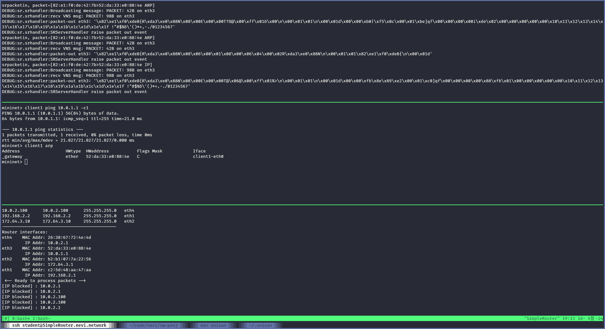
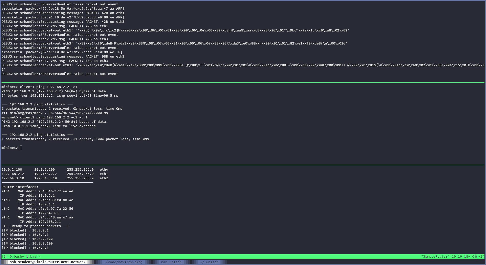
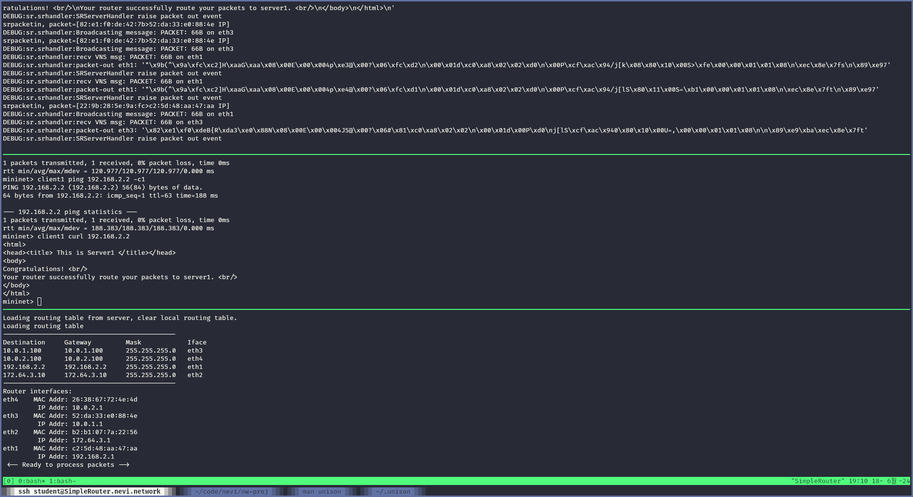
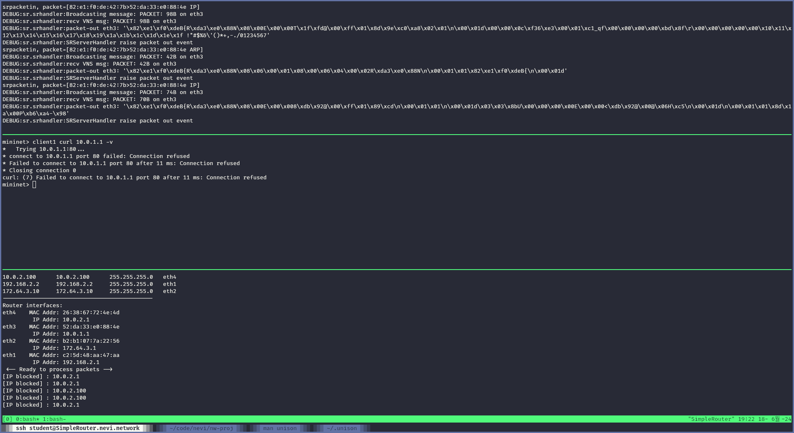
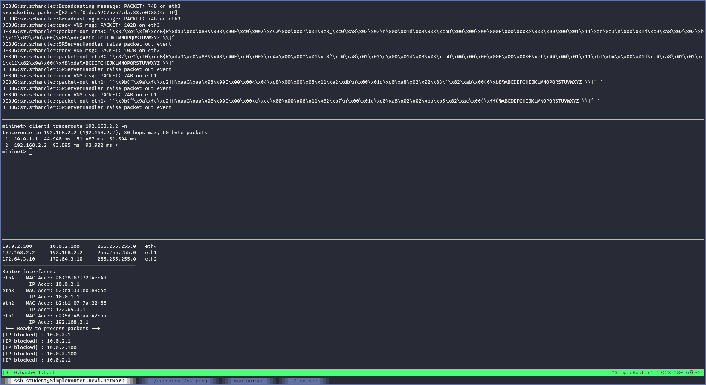

# Project 4: Simple Router (layer 3)

> Yongun Seong 2017-19937

For this assignment, I implemented a L3 router that routes between four ports.

## 1. ARP

While we cannot directly query the router's ARP table, we can see that the
client has correctly resolved the router's MAC address.

## 2. ICMP

ICMP messages are correctly sent from the client to the server.

## 3. IP

ICMP time exceeded messages are correctly sent from the router to the client.

TCP connections are successful:

The router correctly returns ICMP port unreachable messages for closed ports:

Traceroute works:

